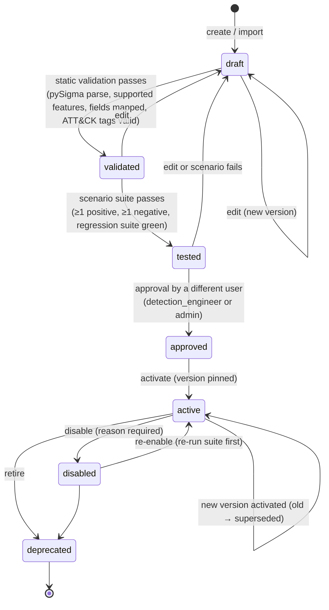
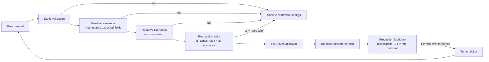

# Detection rule lifecycle

```mermaid
stateDiagram-v2
  [*] --> draft: create / import
  draft --> draft: edit (new version)
  draft --> validated: static validation passes<br/>(pySigma parse, supported features, fields mapped, ATT&CK tags valid)
  validated --> draft: edit
  validated --> tested: scenario suite passes<br/>(≥1 positive, ≥1 negative, regression suite green)
  tested --> draft: edit or scenario fails
  tested --> approved: approval by a different user<br/>(detection_engineer or admin)
  approved --> active: activate (version pinned)
  active --> active: new version activated (old → superseded)
  active --> disabled: disable (reason required)
  disabled --> active: re-enable (re-run suite first)
  active --> deprecated: retire
  disabled --> deprecated
  deprecated --> [*]
```

## Validation pipeline (Module F)

```mermaid
flowchart LR
  A[Rule created] --> B[Static validation]
  B -->|fail| X[Back to draft with findings]
  B --> C[Positive scenarios<br/>must match, expected fields]
  C -->|fail| X
  C --> D[Negative scenarios<br/>must not match]
  D -->|fail| X
  D --> E[Regression suite<br/>all active rules × all scenarios]
  E -->|any regression| X
  E --> F[Four-eyes approval]
  F --> G[Release: activate version]
  G --> H[Production feedback<br/>dispositions → FP rate, precision]
  H -->|FP rate over threshold| I[Tuning ticket]
  I --> A
```
